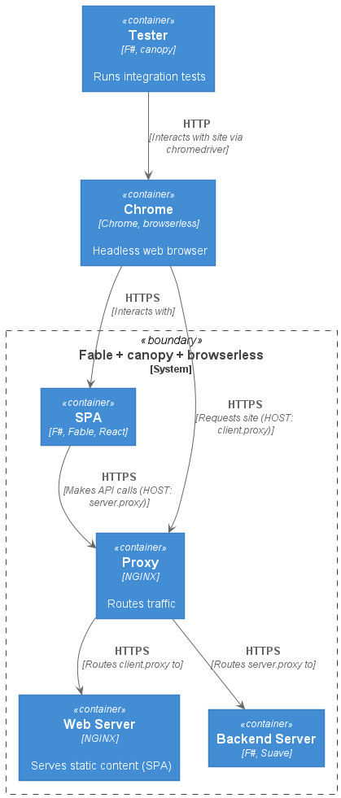

# Fable + canopy + browserless
Test [Fable](https://fable.io) applications using
[canopy](https://lefthandedgoat.github.io/canopy/index.html)
and [browserless](https://docs.browserless.io/). 

Learn more from [this post](https://andrewmeier.dev/fable-canopy-browserless)

## TL;DR
Build the services.
```
docker-compose build
```
Start the services.
```
docker-compose up -d client server proxy chrome
```
Run the example application integration tests using Docker.
```
docker-compose run --rm test-integrations
```

## Structure
```
.
├── README.md           --> You are here
├── app                 --> Client and backend
├── chrome              --> Headless browser
├── etc                 --> Diagrams and images
└── proxy               --> Reverse proxy
```

## Architecture



## Certificates
Test keys and certificates are located in the [chrome/certs](./chrome/certs)
and the [proxy/certs](./proxy/certs) directories.
